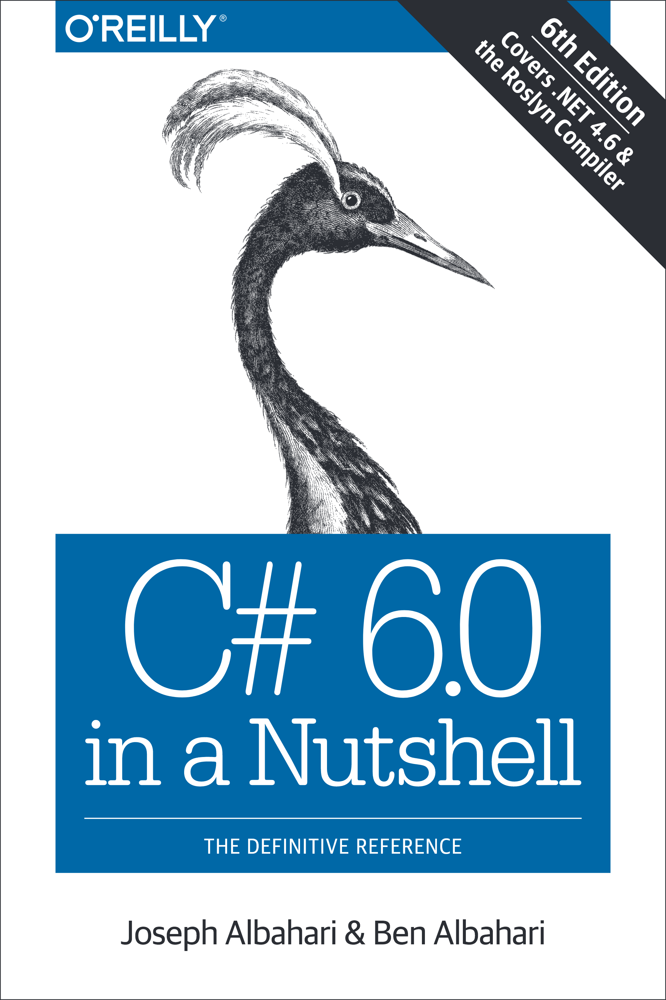
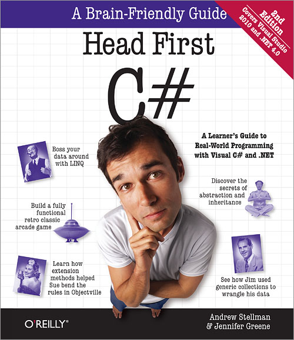

The first chapter of my adventure where I'm going to make a list of sources I will be using druing my learning.
Let's devide the sources into 3 groups:
* Video lessons
* Books
* Additional resources

## Video lessons

There will be 2 resources I'm going to use: ITVDN.COM and UDEMY.COM(not paid advertisement)
1. On the first web resource I've chosen Starter, Essential and Professional packs of learning C# language. In addition to C# I've taken some Unity courses. This resource is Russian-oriented so the lessons are in Russian language as well.
2. On the second one, which is English language oriented, I have decided to choose the course which is called

## Books

Actually, I don't know if I'm going to use them often, but I'll try to.
So, there are 2 books:
1. Albahari J., Albahari B. - C# 6.0 in a Nutshell, 6th Edition - 2015

<figure>
	

</figure>

2. Stellman A., Green J. - Head First C#, 2nd Edition

<figure>
	
	
</figure>

## Addition resources

In order to practice my skills I've found such web resources where you can play the game using your knowledge in C#.
Here they are: 
1. <a href="https://www.codeschool.com/learn/net">Codeschool</a>
2. <a href="https://www.codingame.com/start">Codeingame</a>
3. <a href="https://www.codewars.com/">Codewars</a>